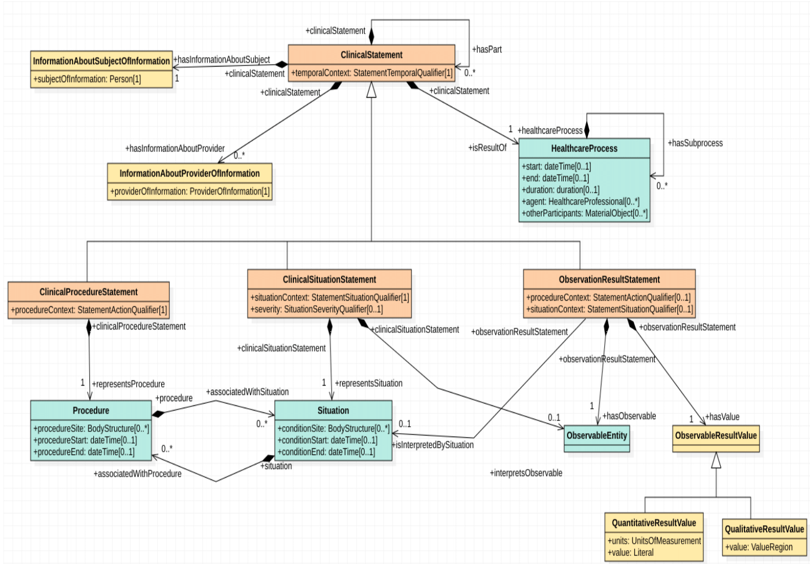

# SCDM
Semantic Common Data Model

This repository contains the ontologies that conforms the Semantic Common Data Model, ready to be extended to represent any biomedical knowledge.

The focus concept of the information model is the **ClinicalStatement** class, which is specialised by specific subclasses that represent documented medical facts (**ClinicalProcedureStatement**, **ClinicalSituationStatement**, **ObservationResultStatement**). Other classes as the one representing the subject (InformationAboutSubjectOfInformation****) and the provider of information (**InformationAboutProviderOfInformation**) or the **HealthcareProcess** class provides context to the documented medical facts. The next figure depicts the UML diagram of the current model:

The proposed ontology infrastructure follows the [semantic harmonization principles from Cunningham et al](https://pubmed.ncbi.nlm.nih.gov/28269840/). It uses the axiomatically rich top-level ontology [BTL2](https://biotopontology.github.io/) as reference harmonization framework to allow the unambiguous integration of domain-specific knowledge. The proposed model is agnostic to existing clinical data modelling specifications and includes both information (e.g. temporal context, provenance, etc.) and clinical domain concepts (e.g. 'stroke', 'obesity', etc.).

Next, we show an example of a **ClinicalSituationStatement** representing the gender of a patient by using the SNOMED CT vocabulary. In blue on the left the main classes of the SCDM appear (ClinicalProcess, ClinicalSituationStatement, and Patient), which have been extended with the SNOMED CT vocabulary (84100007 | History taking (procedure) |, 363787002 | Observable entity (observable entity) |). On the right, the instantiation of the data by using the vocabulary provided by the model is shown:

On the other hand, the next figure depicts an example of **ObservationResultStatement**. In this case, we are representing the participation of a patient in the procedure *FM_ES_EXT_1*, which measures the *range of elbow extension*, and whose result is a numerical value (2 in this case).

Additionally, we have used the SCDM to harmonize data in the context of the [Precise4Q project](https://precise4q.eu/), which is centered in stroke, and whose objective is to improve the quality of life of patients by preventing the disease, by making the best treatment in the acute phase, and by selecting the best promising rehabilitation therapies in order to achieve the highest level of independency during the reintegration of the patient in the society after the disease. In this context, we have developed a query interface for retrieving data from the Precise4Q harmonized database. Although this application is private at the moment due to the clinical nature of the data, we show different uses cases in several videos:

- [Use case 1](/assets/use_case_1.mp4): Take patients with suffered the stroke when they were between 12 and 40 years old. From these patients, select those who improved the memory digit test from Bateria evaluation (they get a score lower than 5 first, and greater than 5 later), and show the GNPT rehabilitation tasks regarding memory training they perform in between the bateria evaluations.
- [Use case 2](/assets/use_case_2.mp4): Get the wrist stability assessment at admission using Fugl-Meyer evaluation of female patients. In this case, the query retrieve results from two heterogeneous datasets that were harmonized by using the SCDM, namely patients from the [Guttmann Institute](https://www.guttmann.com), and patients from the [Interdisciplinary Comprehensive Arm Rehabilitation Evaluation (ICARE)](https://pubmed.ncbi.nlm.nih.gov/23311856/).